# 📚 Windwalker Flags Documentation

This folder contains the **design, architecture, and setup documentation** for the Windwalker Flags project.

> We’ve restored the full diagrams here for quick reference and kept a deeper **pluggable architecture** view in [`architecture.md`](./architecture.md).

---

## 1) System Architecture (High Level)

**Legend**
- **Clients**: SDKs for .NET Standard 2.0, React/Next.js, Angular, AngularJS.
- **API Gateway**: Public entrypoint; routes to Lambda.
- **Lambda (Go GraphQL)**: Business logic, authZ guards, evaluation.
- **DynamoDB**: Single-table design for flags, env states, rules, logs.
- **Cognito**: Initial auth provider (swappable via OIDC/JWT).

➡ See also: [`architecture.md`](./architecture.md) for **pluggable Auth (Cognito/Okta/Auth0/Azure AD)** and **pluggable Data (DynamoDB/Postgres/Mongo/Redis)** diagrams.

---

## 2) Data Model

### Logical Model

### Physical (DynamoDB Single Table)

**Notes**
- **PK/SK**: `PK=FLAG#<id>`, `SK` in `{META, ENV#<ENV>, ENV#<ENV>#RULE#<ruleId>, LOG#<ticks>}`
- **GSI1**: `GSI1PK=ENV#<ENV>`, `GSI1SK=FLAG#<id>` for “flags by environment”

---

## 3) CI/CD Pipeline (GitHub Actions → SAM → Prod)

```mermaid
flowchart LR
  Dev[Developer] -->|branch + commits| GH[GitHub Repo]

  GH --> PR[Open Pull Request]
  PR --> CI1[Job: Lint & Unit Tests\nGo build ./... & go test ./...]
  CI1 --> CI2[Job: GraphQL Checks\nschema snapshot, gql queries compile]
  CI2 --> CI3[Job: Package Lambda\nGOOS=linux build → zip artifact]
  CI3 -->|artifact| Gate[Manual Review/Approval]

  Gate --> Merge[Merge to main]
  Merge --> CD1[Job: SAM Package\nsam package → S3]
  CD1 --> CD2[Job: SAM Deploy prod\ncapabilities: CAPABILITY_NAMED_IAM]
  CD2 --> Post[Post-Deploy Tasks\noutputs → GH env vars\noptional seed script]

  subgraph AWS Prod
    APIGW[API Gateway]
    L[Lambda: Go GraphQL]
    DDB[(DynamoDB: flags)]
    COG[Cognito: User Pool + Groups\nadmin, developer]
  end

  CD2 --> APIGW
  CD2 --> L
  CD2 --> DDB
  CD2 --> COG

  APIGW <--> L
  L <--> DDB
  Clients[.NET / React / Angular / AngularJS] -->|JWT OIDC| APIGW
```

---

## Developer Guides

- Setting up the development environment
- Building and testing the GoLang API
- Adding new feature flags
- Managing role-based access for flag control

(Coming soon in this folder as separate guides.)

---

## SDK Documentation

- .NET Standard 2.0 SDK (works with .NET 8+ and .NET Framework 4.8)
- React/Next.js SDK
- Angular SDK
- AngularJS SDK

(Each SDK will have its own README under `/packages`.)

---

## Infrastructure

- AWS SAM templates for deploying the API
- Future multi-cloud deployment strategy

---

## UI

- Admin UI in React/Next.js
- Angular admin UI (planned)
