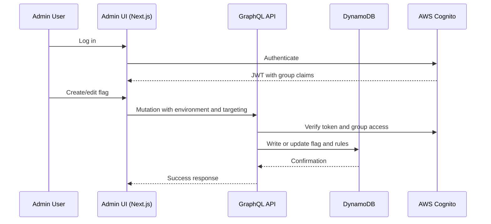

# Admin Workflow: Creating & Managing Flags

```mermaid
sequenceDiagram
  participant Admin as Admin User
  participant UI as Admin UI (Next.js)
  participant API as GraphQL API
  participant DB as DynamoDB
  participant Cognito as AWS Cognito

  Admin->>UI: Log in
  UI->>Cognito: Authenticate
  Cognito-->>UI: JWT with group claims
  Admin->>UI: Create/edit flag
  UI->>API: Mutation with environment and targeting
  API->>Cognito: Verify token and group access
  API->>DB: Write or update flag and rules
  DB-->>API: Confirmation
  API-->>UI: Success response
```