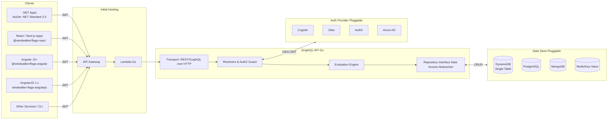

# Windwalker Flags – High-Level Architecture

This diagram reflects the **cloud- and auth-agnostic** direction. AWS (API Gateway, Lambda, DynamoDB, Cognito) is the **initial implementation**, but both **Auth** and **Data** layers are pluggable.

**Legend**
- **Clients**: SDKs for .NET, React/Next.js, Angular, AngularJS (others can call the API directly).
- **API**: Go GraphQL service with a clear **Repository Interface** so the persistence layer is pluggable.
- **Auth**: Any OIDC/JWT-compliant provider (Cognito first; Okta/Auth0/Azure AD swappable).
- **Data**: Starts with **DynamoDB**; adapters for Postgres/Mongo/Redis can be added without changing clients.
- **AWS**: Initial hosting uses API Gateway + Lambda. Containerized or other hosting models can be introduced later.
