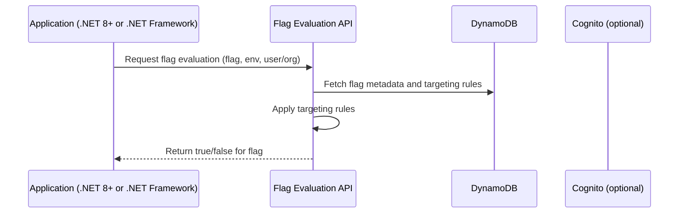

# Feature Flag Evaluation Flow

```mermaid
sequenceDiagram
  participant App as Application (.NET 8+ or .NET Framework)
  participant EvalAPI as Flag Evaluation API
  participant DB as DynamoDB
  participant Cognito as Cognito (optional)

  App->>EvalAPI: Request flag evaluation (flag, env, user/org)
  EvalAPI->>DB: Fetch flag metadata and targeting rules
  EvalAPI->>EvalAPI: Apply targeting rules
  EvalAPI-->>App: Return true/false for flag
```